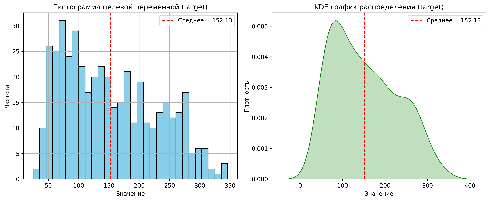
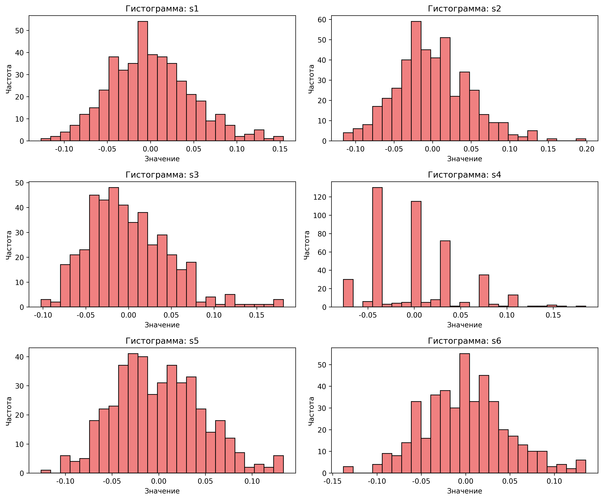
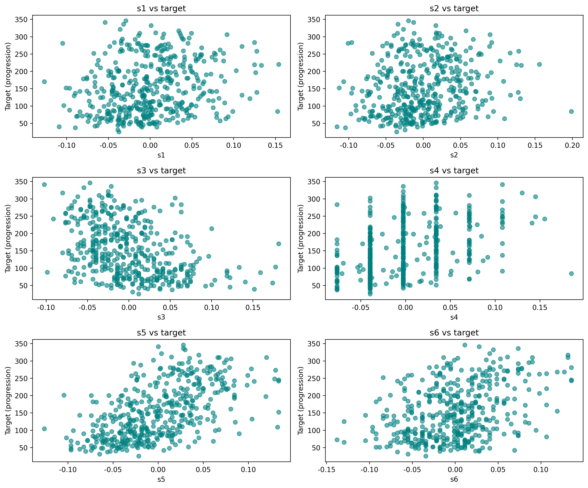
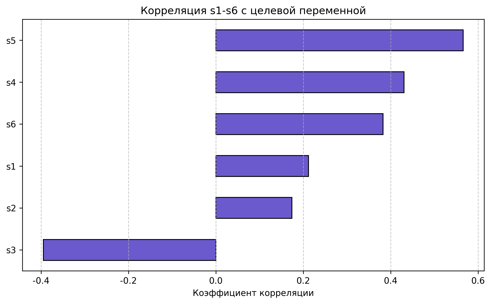

# Анализ датасета Diabetes — Задание 3

---

### 0. Информация о рецензируемых работах

---

### 1. Информация о студенте

- **ФИО:** Степанов Роман Владимирович  
- **Группа:** РИ-150942/2  
- **Номер задания:** 3  
- **Тема:** Анализ датасета Diabetes (регрессионная задача)

---

### 2. Описание задания

Целью задания является exploratory data analysis (EDA) датасета **Diabetes**, загружаемого из `sklearn.datasets`.  
Анализ включает:

- Загрузку и подготовку данных
- Статистический анализ целевой переменной (прогрессия болезни)
- Анализ признаков `s1`, `s2`, `s3`, `s4`, `s5`, `s6` (исключены: `age`, `sex`, `bmi`, `bp`)
- Визуализацию распределений и взаимосвязей
- Оценку корреляций признаков с целевой переменной

Данные описывают прогрессирование диабета у пациентов через год после базовых измерений.  
Целевая переменная — количественная мера прогрессии болезни.

---

### 3. Выполненные работы

#### ✅ Загрузка данных

- Датасет загружен с помощью `sklearn.datasets.load_diabetes()`
- Преобразован в `pandas.DataFrame`
- Добавлен столбец `target` — целевая переменная

#### ✅ Анализ целевой переменной

- Вычислены:  
  - Среднее: ~152.13  
  - Медиана: ~140.50  
  - Стандартное отклонение: ~77.09  
  - Минимум: 25.00, Максимум: 346.0  
  - Квартили: Q1=87.00 Q2=140.50, Q3=211.50  
- Вывод: распределение слегка смещено вправо

#### ✅ Анализ признаков (s1–s6)

- Рассчитаны средние, стандартные отклонения, минимумы и максимумы для признаков `s1`–`s6`
- Все признаки — синтетические (масштабированные), представляют собой биомаркеры
- Диапазон значений: от ~–0.2 до ~0.2
- Средние близки к нулю — признак центрирования

#### ✅ Визуализация

- **Гистограмма и KDE целевой переменной:**  
  Подтверждено умеренное правостороннее смещение.
  
- **Гистограммы признаков `s1`–`s6`:**  
  Распределения близки к нормальному, есть небольшие отклонения.
  
- **Scatter-графики `s1`–`s6` vs `target`:**  
  Визуально оценена линейная зависимость (например, у `s5` — сильная положительная связь, у `s3` — сильная отрицательная).
  
- **Корреляции:**  
  Построена горизонтальная столбчатая диаграмма коэффициентов корреляции.
  

---

### 4. Статистика

#### 📊 Таблица корреляций (признаки s1–s6 vs target)

| Признак | Корреляция с `target` |
|--------|------------------------|
| s1     | 0.2120                 |
| s2     | 0.1741                 |
| s3     | -0.3948                |
| s4     | 0.4305                 |
| s5     | 0.5659                 |
| s6     | 0.3825                 |

#### 🔑 Ключевые числа

- Количество объектов: 442
- Количество анализируемых признаков: 6 (`s1`–`s6`)
- Наиболее коррелирующий признак: **s5** (r ≈ 0.57)
- Наименее коррелирующий: **s2** (r ≈ 0.17)

---

### 5. Ключевые находки

1. **Признак `s5`** демонстрирует **наиболее сильную положительную корреляцию** с прогрессией диабета. Это может указывать на его высокую предсказательную силу.
2. **Признак `s3`** показывает **отрицательную корреляцию** с прогрессией диабета. Это также может быть полезно при анализе данных.
3. Распределение целевой переменной **не идеально нормальное**, что может потребовать трансформации при построении регрессионной модели.
4. Признаки `s1` и `s2` показывают **слабую корреляцию** (r ≈ 0.2), их вклад в модель может быть ограничен.
5. Признаки `s4` и `s6` показывают **умеренную корреляцию** (r > 0.3), что заслуживает внимания.
6. Исключение `age`, `sex`, `bmi`, `bp` упрощает анализ, но в будущем стоит проверить, не теряется ли важная информация.

> **Вывод:** Для прогнозирования прогрессии диабета наиболее важными биомаркерами из группы `s1`–`s6` является `s3` и `s5`. Остальные признаки могут использоваться как дополнительные, но их вес в модели будет меньше.

---

### 6. Файлы

#### 📁 Созданные файлы:

- `assignment.py` — основной скрипт анализа
- `README.md` — отчёт по заданию
- `03_diabetes_target_distribution.png` — гистограмма и KDE `target`
- `03_diabetes_features_distribution.png` — гистограммы `s1`–`s6`
- `03_diabetes_features_vs_target.png` — scatter-графики признаков vs `target`
- `03_diabetes_correlation_bars.png` — столбчатая диаграмма корреляций

#### 🗑️ Удалённые файлы:

- `CONTRIBUTING.md` - файл с требованиями к заданию

---

✅ **Анализ завершён. Все графики сохранены. Рекомендации сформулированы.**
