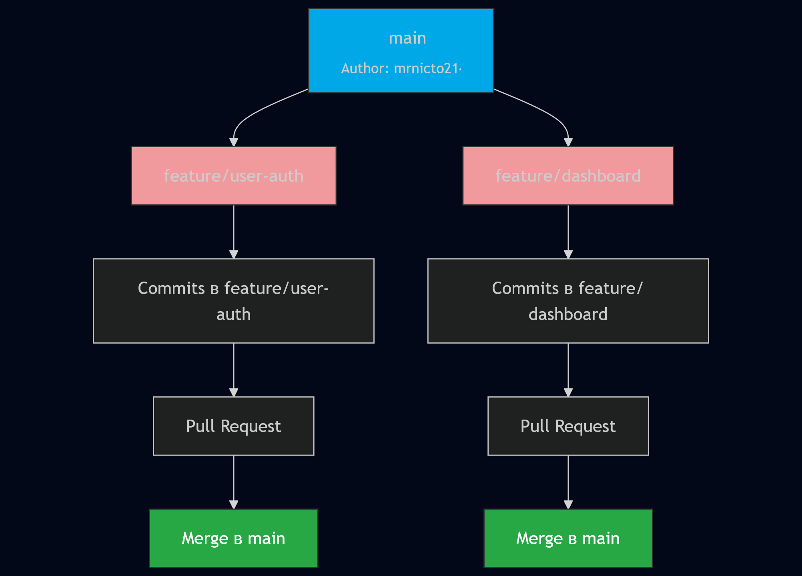
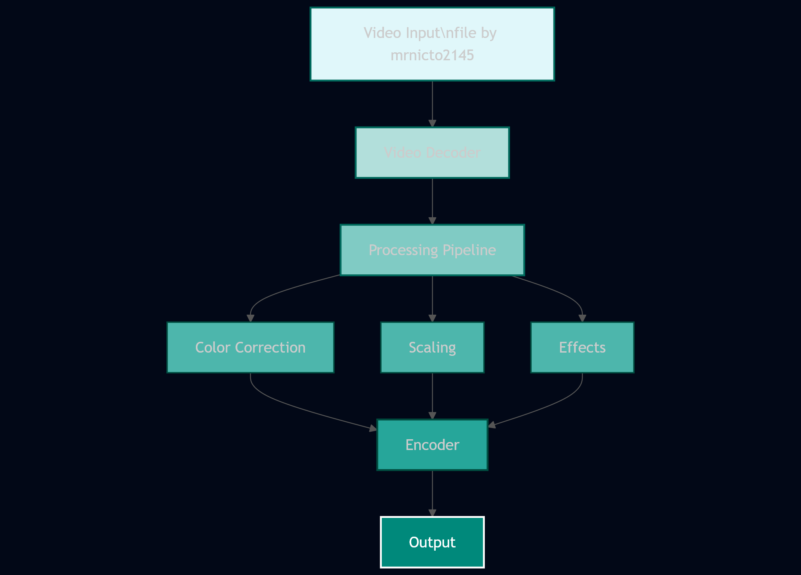
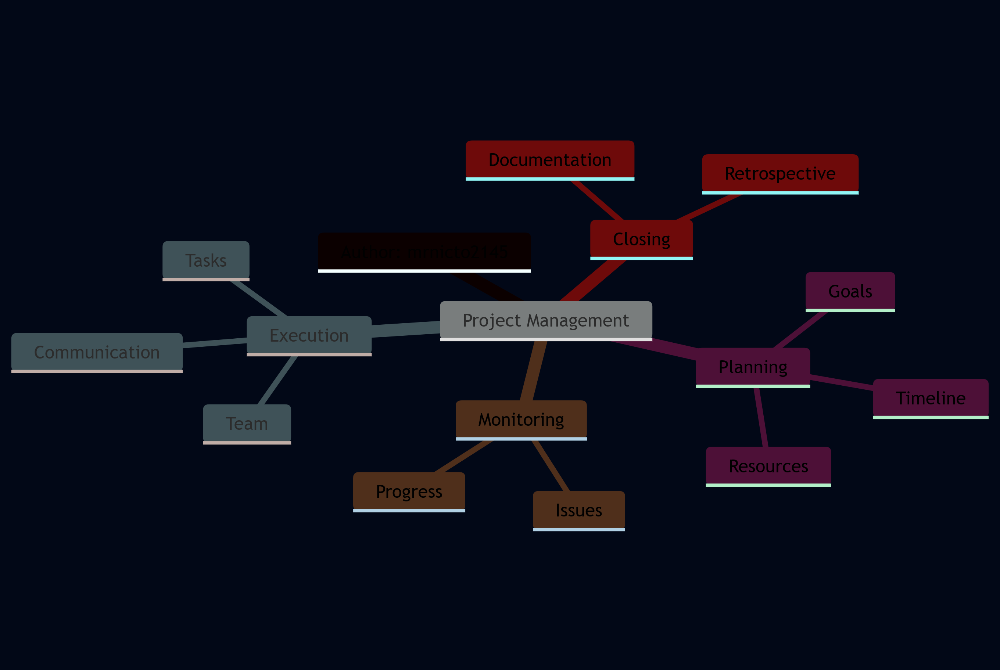
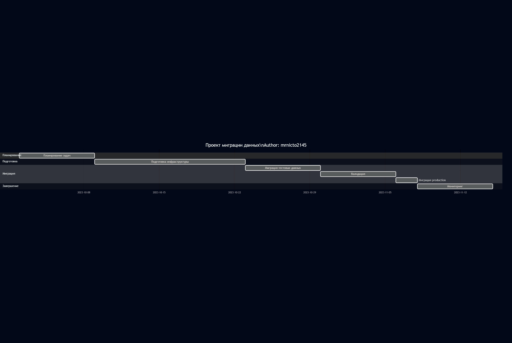
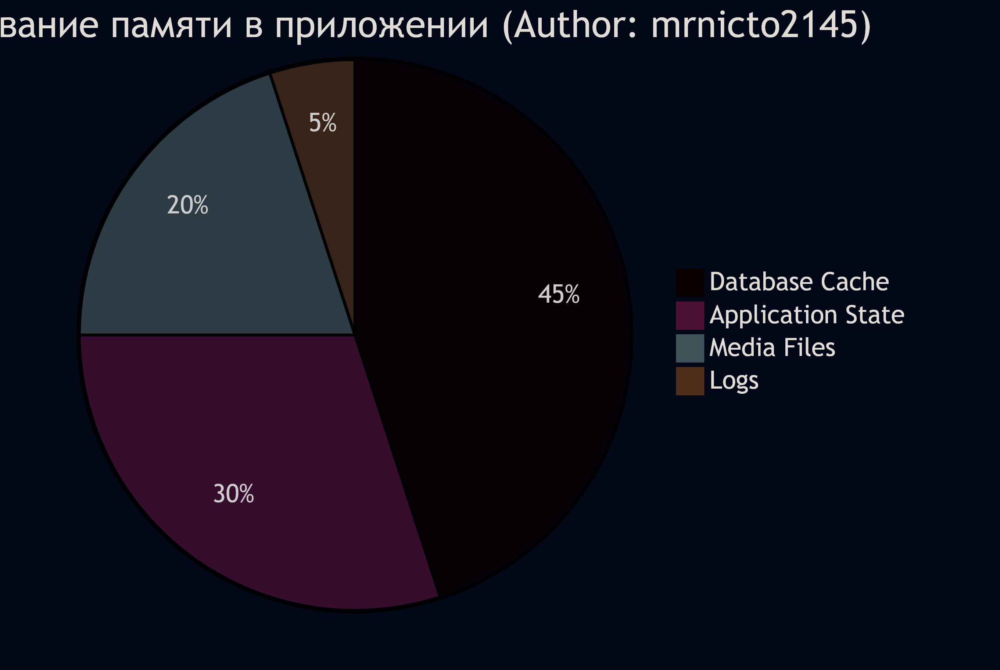

### Диаграмма 1: Feature branch workflow

Описывает работу над новой "фичей" в отдельной ветке

---

### Диаграмма 2: Обработка видеопотока

Описывает в общих чертах обработку видеопотока от входа до выхода.

---

### Диаграмма 3: Компоненты системы управления проектами

Показывает компоненты, на которые зачастую Project Manager делит проект.

---

### Диаграмма 4: Проект миграции данных

Описание количества времени, требуемого на каждый этап миграции данных

---

### Диаграмма 5: Использование памяти в приложении

Показывает, какое примерно количество памяти от общего занимают каждый элемент программы.

