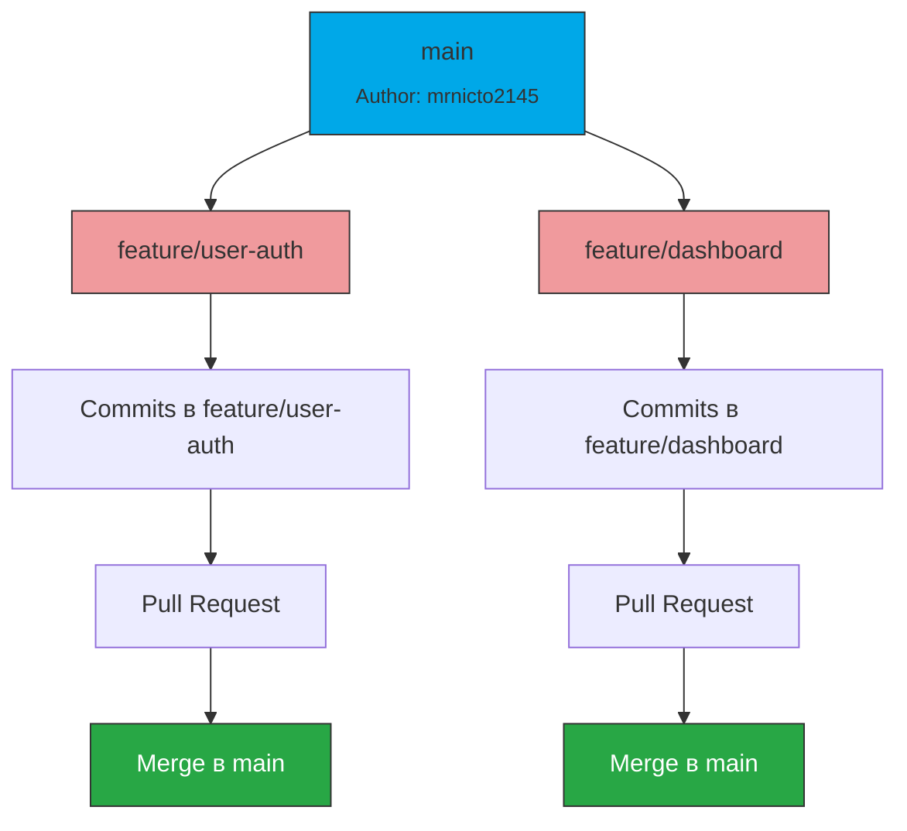

**Промт1:**
Ты системный архитектор. Твоя задача - писать код для Mermaid графа, который будет описывать ветвление проекта. В название проекта добавляй подпись "Author: mrnicto2145". Тебе будут поступать тема и общее представление проекта в следующих сообщениях.

**Ответ:**
Понял. Готов принимать тему и описание проекта для создания Mermaid-графа с указанием авторства.
Жду следующее сообщение.

---

**Промт2:**
Вот первая тема:"Feature branch workflow: main → feature/user-auth ветка → commits → pull request → merge в main. Параллельно другой feature branch feature/dashboard."

**Ответ:**

Этот Mermaid-граф описывает Feature Branch Workflow:

Ветка main — основная стабильная ветка.
От main создаются две независимые feature-ветки:
feature/user-auth — проходит серию коммитов, затем создаётся pull request, после чего мержится в main.
feature/dashboard — параллельно развивается, затем аналогично проходит PR и мерж.
Стилизация:
main — синий.
feature-ветки — розовые.
Финальные мержи в main — зелёные для визуального обозначения завершения.
Подпись Author: mrnicto2145 добавлена в заголовок основной ветки main.