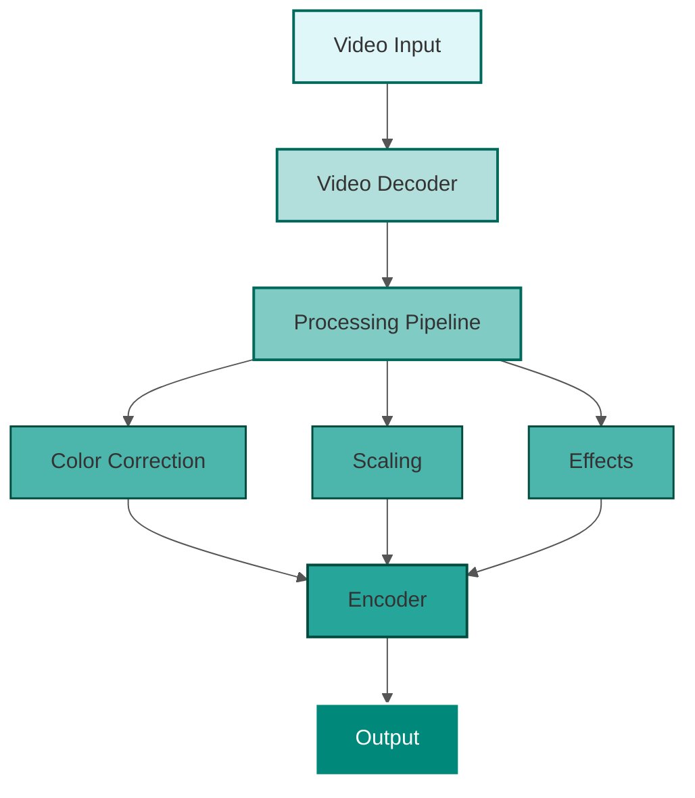
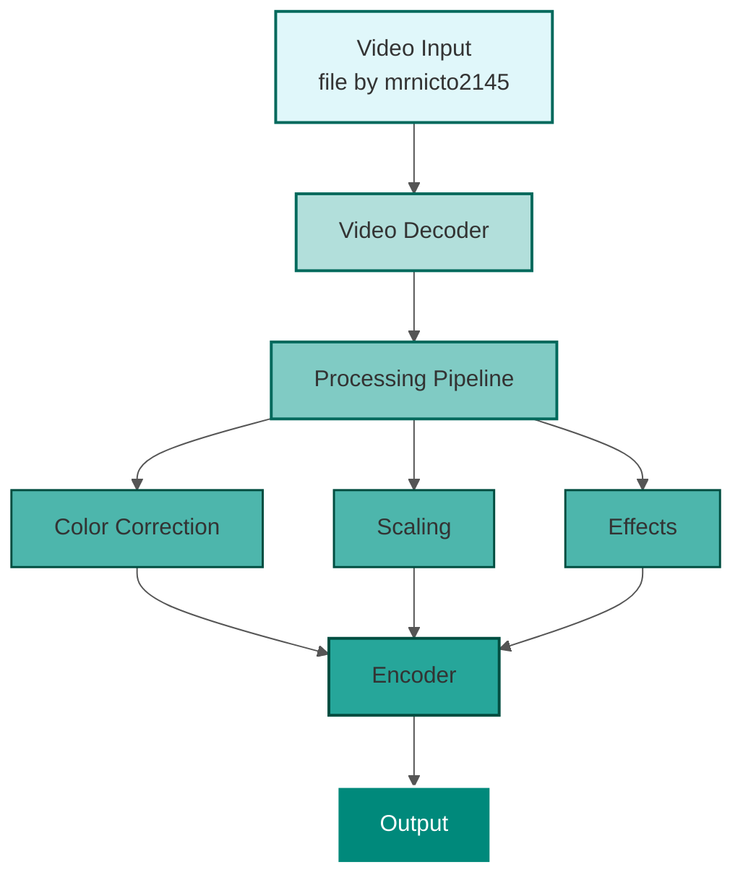

**Промт 1**
Ты системный архитектор. Твоя задача - писать код для Mermaid для Block Diagram (Блок-диаграмма). В название проекта добавляй подпись "Обработка видеопотока: Video Input → Video Decoder → Processing Pipeline (Color Correction, Scaling, Effects) → Encoder → Output."

**Ответ**

**Промт 2**
Убери все click и добавь в Video Input подпись "file by mrnicto2145"

**Ответ**
